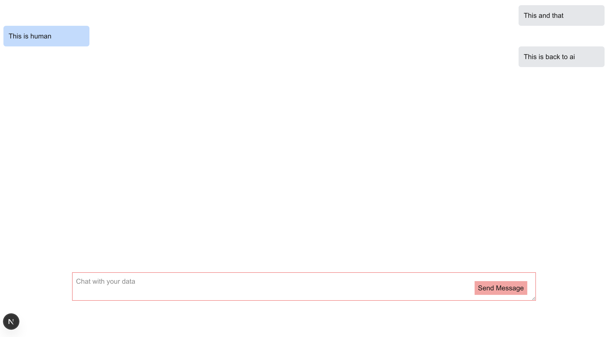

# Holly Engineering Take-Home Assignment

## Overview

This take-home assignment is designed to evaluate your technical skills across several areas important to our engineering team. Please spend no more than 2-3 hours on this task. It's completely fine if you don't finish everything - we're more interested in understanding your approach and thought process.

## Goals

This assignment evaluates your skills in:

1. Data processing
2. Next.js development
3. LLM integration
4. TypeScript

## The Challenge

You'll build a simple chat interface that allows users to query job and salary information stored in JSON files. Think of it as a basic HR assistant that can answer questions about job descriptions and compensation. The interface doesn't have to be anything fancy.

## Requirements

### 1. Data Processing (~30 mins)

- Start by creating a script (`matchJdAndSal.js`) that matches job descriptions in `data/job-descriptions.json` with corresponding salary data in `data/salaries.json`
- The final output should be saved in `data/matching.json`
- Sample output format:
  ```json
  {
    "jurisdiction": "sanbernardino",
    "code": "01297",
    "title": "Assistant Chief Probation Officer",
    "description": "Definition\nUnder general direction, assists the Chief Probation Officer...",
    "salary_grade_1": "$70.38",
    "salary_grade_2": "$101.00",
    "salary_grade_3": "",
    "salary_grade_4": "",
    "salary_grade_5": "",
    "salary_grade_6": "",
    "salary_grade_7": "",
    "salary_grade_8": "",
    "salary_grade_9": "",
    "salary_grade_10": "",
    "salary_grade_11": "",
    "salary_grade_12": "",
    "salary_grade_13": "",
    "salary_grade_14": ""
  }
  ```

### 2. Chat Interface (~30 mins)

- Create a dedicated chat page (`/chat`) with a message interface
- Style the interface so AI messages appear on the right and human messages on the left
- The UI doesn't need to be elaborate - focus on functionality over aesthetics



### 3. LLM Integration (~1 hr 30 mins)

- Integrate with an LLM of your choice
- The LLM should be able to answer questions about the data in your matched dataset
- **Important**: Your implementation should parse the user's query to identify which specific job they're asking about, and only pass the relevant job information to the LLM - do not pass the entire dataset to the LLM with each request
- Example queries and responses:
  - "What are the knowledge, skills, and abilities for the Assistant Sheriff San Diego County position?"
    - "The Assistant Sheriff in San Diego County should have knowledge of: local law enforcement agencies in San Diego County, local/state/federal laws, law enforcement rules and regulations, community-based policing..."
  - "What is the salary for the Assistant Chief Probation Officer in San Bernardino?"
    - "The Assistant Chief Probation Officer in San Bernardino has a salary range from $70.38 to $101.00 per hour (salary grades 1 and 2)."

## Technical Requirements

- Use Next.js for the application framework
- Implement proper TypeScript typing throughout the application
- Implement server actions where appropriate
- Do not use a dedicated backend server or database - all data should be stored and retrieved from the JSON files
- Clean, maintainable code with clear organization

## Submission

Please submit:

1. The complete codebase in a public GitHub repository
2. Instructions for running the application locally
3. A brief writeup explaining your approach, technologies used, and any challenges you faced

## Notes

- You're free to use any NLP approach (vector embeddings, etc.) to enable querying the data
- Focus on demonstrating your understanding of Next.js patterns, TypeScript, and clean code organization
- Don't spend too much time on UI aesthetics - functionality is the priority
- Use `matching.json` and other JSON files as your database - no need for external data storage
- We'll be evaluating how efficiently you process and filter data before sending to the LLM
